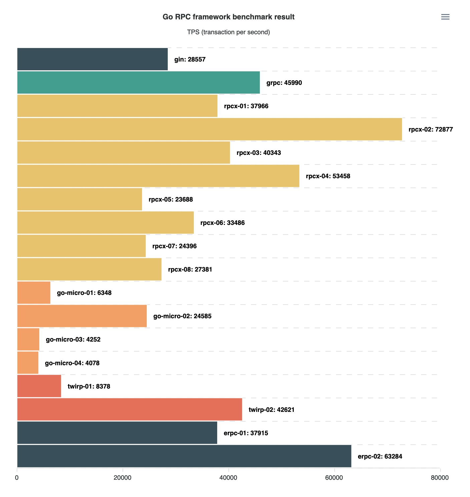

[](https://micro-svc.github.io/go-rpc-framework-benchmark)

更新时间：2020-10-14

## 压测列表

> 机器配置：4 Cores 16G

> 类型说明：
> `RPC` 表示只实现了简单的 RPC 功能；
> `MIC` 表示实现了微服务框架的大部分特性；
> `WEB` 表示传统的 WEB 框架，只是作为对比出现。

| name        | type  | package                                          | transport | codec      |     tps |
| ----------- | ----- | ------------------------------------------------ | --------- | ---------- | ------: |
| gin         | `WEB` | [gin](https://github.com/gin-gonic/gin)          | `http`    | `json`     | `28557` |
| grpc        | `RPC` | [grpc](https://github.com/grpc/grpc-go)          | `grpc`    | `protobuf` | `45990` |
| rpcx-01     | `MIC` | [rpcx/v5](https://github.com/smallnest/rpcx)     | `tcp`     | `json`     | `37966` |
| rpcx-02     | `MIC` | [rpcx/v5](https://github.com/smallnest/rpcx)     | `tcp`     | `protobuf` | `72877` |
| rpcx-03     | `MIC` | [rpcx/v5](https://github.com/smallnest/rpcx)     | `tcp`     | `msgpack`  | `40343` |
| rpcx-04     | `MIC` | [rpcx/v5](https://github.com/smallnest/rpcx)     | `tcp`     | `jsoniter` | `53458` |
| rpcx-05     | `MIC` | [rpcx/v5](https://github.com/smallnest/rpcx)     | `quic`    | `json`     | `23688` |
| rpcx-06     | `MIC` | [rpcx/v5](https://github.com/smallnest/rpcx)     | `quic`    | `protobuf` | `33486` |
| rpcx-07     | `MIC` | [rpcx/v5](https://github.com/smallnest/rpcx)     | `quic`    | `msgpack`  | `24396` |
| rpcx-08     | `MIC` | [rpcx/v5](https://github.com/smallnest/rpcx)     | `quic`    | `jsoniter` | `27381` |
| go-micro-01 | `MIC` | [go-micro/v2](https://github.com/micro/go-micro) | `grpc`    | `json`     |  `6348` |
| go-micro-02 | `MIC` | [go-micro/v2](https://github.com/micro/go-micro) | `grpc`    | `protobuf` | `24585` |
| go-micro-03 | `MIC` | [go-micro/v2](https://github.com/micro/go-micro) | `http`    | `json`     |  `4252` |
| go-micro-04 | `MIC` | [go-micro/v2](https://github.com/micro/go-micro) | `http`    | `protobuf` |  `4078` |
| twirp-01    | `RPC` | [twirp/v7](https://github.com/twitchtv/twirp)    | `http`    | `json`     |  `8378` |
| twirp-02    | `RPC` | [twirp/v7](https://github.com/twitchtv/twirp)    | `http`    | `protobuf` | `42621` |
| erpc-01     | `RPC` | [erpc-v6](https://github.com/henrylee2cn/erpc)   | `tcp`     | `json`     | `37915` |
| erpc-02     | `RPC` | [erpc-v6](https://github.com/henrylee2cn/erpc)   | `tcp`     | `protobuf` | `63284` |

### gin

```sh
$ bin/gin-cli
{"time":"2020-10-14T00:35:39.597+08:00","level":"info","caller":"main.go:38","goid":1,"clients":100,"requests":1000,"total":100000}
{"time":"2020-10-14T00:35:43.131+08:00","level":"info","caller":"main.go:61","goid":1,"tps":28557,"min":"156.782µs","max":"43.384843ms","mean":"3.434105ms","median":"2.39446ms"}
```

### grpc

```sh
$ bin/grpc-cli
{"time":"2020-10-14T00:36:01.997+08:00","level":"info","caller":"main.go:34","goid":1,"clients":100,"requests":1000,"total":100000}
{"time":"2020-10-14T00:36:04.201+08:00","level":"info","caller":"main.go:57","goid":1,"tps":45990,"min":"126.234µs","max":"26.849924ms","mean":"2.157739ms","median":"1.893807ms"}
```

### rpcx-01

```sh
$ bin/rpcx-v5-cli --transport=tcp --codec=json
{"time":"2020-10-14T00:36:23.189+08:00","level":"info","caller":"main.go:65","goid":1,"clients":100,"requests":1000,"total":100000}
{"time":"2020-10-14T00:36:25.855+08:00","level":"info","caller":"main.go:88","goid":1,"tps":37966,"min":"129.239µs","max":"33.919414ms","mean":"2.569774ms","median":"1.905504ms"}
```

### rpcx-02

```sh
$ bin/rpcx-v5-cli --transport=tcp --codec=protobuf
{"time":"2020-10-14T00:36:44.498+08:00","level":"info","caller":"main.go:65","goid":1,"clients":100,"requests":1000,"total":100000}
{"time":"2020-10-14T00:36:45.903+08:00","level":"info","caller":"main.go:88","goid":1,"tps":72877,"min":"71.469µs","max":"22.851623ms","mean":"1.335923ms","median":"1.06812ms"}
```

### rpcx-03

```sh
$ bin/rpcx-v5-cli --transport=tcp --codec=msgpack
{"time":"2020-10-14T00:37:04.563+08:00","level":"info","caller":"main.go:65","goid":1,"clients":100,"requests":1000,"total":100000}
{"time":"2020-10-14T00:37:07.073+08:00","level":"info","caller":"main.go:88","goid":1,"tps":40343,"min":"130.478µs","max":"29.238847ms","mean":"2.422756ms","median":"1.835293ms"}
```

### rpcx-04

```sh
$ bin/rpcx-v5-cli --transport=tcp --codec=jsoniter
{"time":"2020-10-14T00:37:25.715+08:00","level":"info","caller":"main.go:65","goid":1,"clients":100,"requests":1000,"total":100000}
{"time":"2020-10-14T00:37:27.621+08:00","level":"info","caller":"main.go:88","goid":1,"tps":53458,"min":"82.725µs","max":"18.725908ms","mean":"1.841114ms","median":"1.436783ms"}
```

### rpcx-05

```sh
$ bin/rpcx-v5-cli --transport=quic --codec=json
{"time":"2020-10-14T00:37:46.588+08:00","level":"info","caller":"main.go:65","goid":1,"clients":100,"requests":1000,"total":100000}
{"time":"2020-10-14T00:37:50.842+08:00","level":"info","caller":"main.go:88","goid":1,"tps":23688,"min":"199.266µs","max":"64.027781ms","mean":"4.151358ms","median":"3.133179ms"}
```

### rpcx-06

```sh
$ bin/rpcx-v5-cli --transport=quic --codec=protobuf
{"time":"2020-10-14T00:38:09.799+08:00","level":"info","caller":"main.go:65","goid":1,"clients":100,"requests":1000,"total":100000}
{"time":"2020-10-14T00:38:12.814+08:00","level":"info","caller":"main.go:88","goid":1,"tps":33486,"min":"147.74µs","max":"53.547107ms","mean":"2.930951ms","median":"2.356364ms"}
```

### rpcx-07

```sh
$ bin/rpcx-v5-cli --transport=quic --codec=msgpack
{"time":"2020-10-14T00:38:31.774+08:00","level":"info","caller":"main.go:65","goid":1,"clients":100,"requests":1000,"total":100000}
{"time":"2020-10-14T00:38:35.904+08:00","level":"info","caller":"main.go:88","goid":1,"tps":24396,"min":"193.338µs","max":"65.875473ms","mean":"3.999913ms","median":"3.02633ms"}
```

### rpcx-08

```sh
$ bin/rpcx-v5-cli --transport=quic --codec=jsoniter
{"time":"2020-10-14T00:38:54.853+08:00","level":"info","caller":"main.go:65","goid":1,"clients":100,"requests":1000,"total":100000}
{"time":"2020-10-14T00:38:58.538+08:00","level":"info","caller":"main.go:88","goid":1,"tps":27381,"min":"177.63µs","max":"77.997686ms","mean":"3.580546ms","median":"2.825087ms"}
```

### go-micro-01

```sh
$ bin/go-micro-v2-cli --transport=grpc --codec=json
{"time":"2020-10-14T00:39:17.597+08:00","level":"info","caller":"main.go:79","goid":1,"clients":100,"requests":1000,"total":100000}
{"time":"2020-10-14T00:39:33.382+08:00","level":"info","caller":"main.go:102","goid":1,"tps":6348,"min":"495.924µs","max":"154.717636ms","mean":"15.428922ms","median":"10.737811ms"}
```

### go-micro-02

```sh
$ bin/go-micro-v2-cli --transport=grpc --codec=protobuf
{"time":"2020-10-14T00:39:52.151+08:00","level":"info","caller":"main.go:79","goid":1,"clients":100,"requests":1000,"total":100000}
{"time":"2020-10-14T00:39:56.248+08:00","level":"info","caller":"main.go:102","goid":1,"tps":24585,"min":"234.509µs","max":"20.9508ms","mean":"4.007815ms","median":"3.342336ms"}
```

### go-micro-03

```sh
$ bin/go-micro-v2-cli --transport=http --codec=json
{"time":"2020-10-14T00:40:15.049+08:00","level":"info","caller":"main.go:79","goid":1,"clients":100,"requests":1000,"total":100000}
{"time":"2020-10-14T00:40:38.590+08:00","level":"info","caller":"main.go:102","goid":1,"tps":4252,"min":"746.518µs","max":"371.581326ms","mean":"23.428619ms","median":"22.99897ms"}
```

### go-micro-04

```sh
$ bin/go-micro-v2-cli --transport=http --codec=protobuf
{"time":"2020-10-14T00:40:57.393+08:00","level":"info","caller":"main.go:79","goid":1,"clients":100,"requests":1000,"total":100000}
{"time":"2020-10-14T00:41:21.941+08:00","level":"info","caller":"main.go:102","goid":1,"tps":4078,"min":"845.478µs","max":"119.1691ms","mean":"24.46756ms","median":"24.387342ms"}
```

### twirp-01

```sh
$ bin/twirp-v7-cli --codec=json
{"time":"2020-10-14T00:41:40.768+08:00","level":"info","caller":"main.go:49","goid":1,"clients":100,"requests":1000,"total":100000}
{"time":"2020-10-14T00:41:52.737+08:00","level":"info","caller":"main.go:72","goid":1,"tps":8378,"min":"420.07µs","max":"140.556351ms","mean":"11.703132ms","median":"7.897057ms"}
```

### twirp-02

```sh
$ bin/twirp-v7-cli --codec=protobuf
{"time":"2020-10-14T00:42:11.363+08:00","level":"info","caller":"main.go:49","goid":1,"clients":100,"requests":1000,"total":100000}
{"time":"2020-10-14T00:42:13.744+08:00","level":"info","caller":"main.go:72","goid":1,"tps":42621,"min":"100.661µs","max":"26.835642ms","mean":"2.298636ms","median":"1.596577ms"}
```

### erpc-01

```sh
$ bin/erpc-v6-cli --codec=json
{"time":"2020-10-14T00:42:32.971+08:00","level":"info","clients":100,"requests":1000,"total":100000}
{"time":"2020-10-14T00:42:35.642+08:00","level":"info","tps":37915,"min":"108.149µs","max":"32.263108ms","mean":"2.571705ms","median":"1.579081ms"}
```

### erpc-02

```sh
$ bin/erpc-v6-cli --codec=protobuf
{"time":"2020-10-14T00:42:54.293+08:00","level":"info","clients":100,"requests":1000,"total":100000}
{"time":"2020-10-14T00:42:55.906+08:00","level":"info","tps":63284,"min":"74.942µs","max":"22.63617ms","mean":"1.538504ms","median":"995.148µs"}
```

## TODO

- [go-chassis](https://github.com/go-chassis/go-chassis)
- [TarsGo](https://github.com/TarsCloud/TarsGo)
- [go-zero](https://github.com/tal-tech/go-zero)
