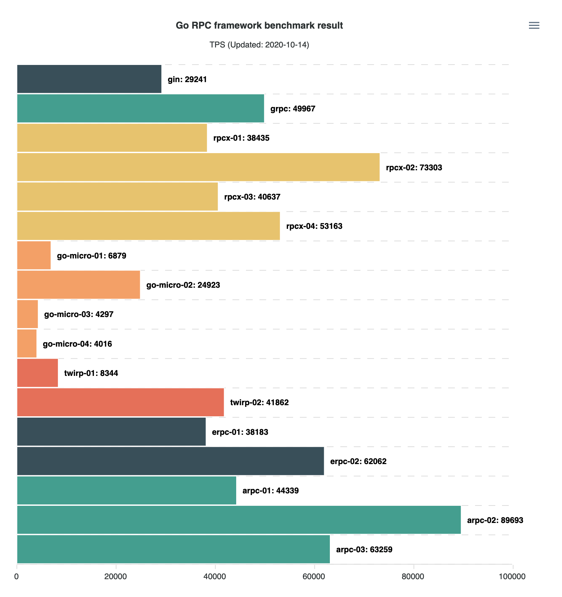

[](https://micro-svc.github.io/go-rpc-framework-benchmark/)

## 测试结果

| name        | package     | transport | codec      |   tps |
| ----------- | ----------- | --------- | ---------- | ----: |
| gin         | gin         | `http`    | `json`     | 29241 |
| grpc        | grpc        | `grpc`    | `protobuf` | 49967 |
| rpcx-01     | rpcx-v5     | `tcp`     | `json`     | 38435 |
| rpcx-02     | rpcx-v5     | `tcp`     | `protobuf` | 73303 |
| rpcx-03     | rpcx-v5     | `tcp`     | `msgpack`  | 40637 |
| rpcx-04     | rpcx-v5     | `tcp`     | `jsoniter` | 53163 |
| go-micro-01 | go-micro-v2 | `grpc`    | `json`     |  6879 |
| go-micro-02 | go-micro-v2 | `grpc`    | `protobuf` | 24923 |
| go-micro-03 | go-micro-v2 | `http`    | `json`     |  4297 |
| go-micro-04 | go-micro-v2 | `http`    | `protobuf` |  4016 |
| twirp-01    | twirp-v7    | `http`    | `json`     |  8344 |
| twirp-02    | twirp-v7    | `http`    | `protobuf` | 41862 |
| erpc-01     | erpc-v6     | `tcp`     | `json`     | 38183 |
| erpc-02     | erpc-v6     | `tcp`     | `protobuf` | 62062 |
| arpc-01     | arpc        | `tcp`     | `json`     | 44339 |
| arpc-02     | arpc        | `tcp`     | `protobuf` | 89693 |
| arpc-03     | arpc        | `tcp`     | `jsoniter` | 63259 |

> 机器配置：4 Cores 16G Memory

> 更新时间：2020-10-14

## 测试列表

- [gin](https://github.com/gin-gonic/gin)：WEB 框架，用来和 RPC 做对比
- [grpc](https://github.com/grpc/grpc-go)：跨语言 RPC 框架
- [rpcx/v5](https://github.com/smallnest/rpcx)：RPC 框架，自带微服务组件
- [go-micro/v2](https://github.com/micro/go-micro)：RPC 框架，自带微服务组件
- [twirp/v7](https://github.com/twitchtv/twirp)：RPC 框架
- [erpc-v6](https://github.com/henrylee2cn/erpc)：RPC 框架
- [arpc](https://github.com/lesismal/arpc)：RPC 框架

## 详细结果

### gin

```sh
$ bin/gin-cli --transport=http --codec=json
{"time":"2020-10-14T22:12:59.380+08:00","level":"info","caller":"main.go:52","goid":1,"clients":100,"requests":1000,"total":100000}
{"time":"2020-10-14T22:13:02.834+08:00","level":"info","caller":"main.go:75","goid":1,"tps":29241,"min":"133.706µs","max":"33.977848ms","mean":"3.361119ms","median":"2.349353ms"}
```

### grpc

```sh
$ bin/grpc-cli --transport=grpc --codec=protobuf
{"time":"2020-10-14T22:13:22.086+08:00","level":"info","caller":"main.go:48","goid":1,"clients":100,"requests":1000,"total":100000}
{"time":"2020-10-14T22:13:24.118+08:00","level":"info","caller":"main.go:71","goid":1,"tps":49967,"min":"149.954µs","max":"19.60794ms","mean":"1.98342ms","median":"1.767637ms"}
```

### rpcx-01

```sh
$ bin/rpcx-v5-cli --transport=tcp --codec=json
{"time":"2020-10-14T22:13:43.265+08:00","level":"info","caller":"main.go:65","goid":1,"clients":100,"requests":1000,"total":100000}
{"time":"2020-10-14T22:13:45.901+08:00","level":"info","caller":"main.go:88","goid":1,"tps":38435,"min":"128.622µs","max":"29.78092ms","mean":"2.54391ms","median":"1.879683ms"}
```

### rpcx-02

```sh
$ bin/rpcx-v5-cli --transport=tcp --codec=protobuf
{"time":"2020-10-14T22:14:04.532+08:00","level":"info","caller":"main.go:65","goid":1,"clients":100,"requests":1000,"total":100000}
{"time":"2020-10-14T22:14:05.928+08:00","level":"info","caller":"main.go:88","goid":1,"tps":73303,"min":"74.261µs","max":"20.752848ms","mean":"1.330593ms","median":"1.080378ms"}
```

### rpcx-03

```sh
$ bin/rpcx-v5-cli --transport=tcp --codec=msgpack
{"time":"2020-10-14T22:14:24.565+08:00","level":"info","caller":"main.go:65","goid":1,"clients":100,"requests":1000,"total":100000}
{"time":"2020-10-14T22:14:27.057+08:00","level":"info","caller":"main.go:88","goid":1,"tps":40637,"min":"115.936µs","max":"27.667247ms","mean":"2.409238ms","median":"1.826393ms"}
```

### rpcx-04

```sh
$ bin/rpcx-v5-cli --transport=tcp --codec=jsoniter
{"time":"2020-10-14T22:14:45.688+08:00","level":"info","caller":"main.go:65","goid":1,"clients":100,"requests":1000,"total":100000}
{"time":"2020-10-14T22:14:47.601+08:00","level":"info","caller":"main.go:88","goid":1,"tps":53163,"min":"85.394µs","max":"21.437595ms","mean":"1.844519ms","median":"1.456187ms"}
```

### go-micro-01

```sh
$ bin/go-micro-v2-cli --transport=grpc --codec=json
{"time":"2020-10-14T22:15:06.756+08:00","level":"info","caller":"main.go:79","goid":1,"clients":100,"requests":1000,"total":100000}
{"time":"2020-10-14T22:15:21.323+08:00","level":"info","caller":"main.go:102","goid":1,"tps":6879,"min":"581.034µs","max":"130.350326ms","mean":"14.278674ms","median":"9.94277ms"}
```

### go-micro-02

```sh
$ bin/go-micro-v2-cli --transport=grpc --codec=protobuf
{"time":"2020-10-14T22:15:40.075+08:00","level":"info","caller":"main.go:79","goid":1,"clients":100,"requests":1000,"total":100000}
{"time":"2020-10-14T22:15:44.120+08:00","level":"info","caller":"main.go:102","goid":1,"tps":24923,"min":"218.682µs","max":"22.308351ms","mean":"3.958798ms","median":"3.332323ms"}
```

### go-micro-03

```sh
$ bin/go-micro-v2-cli --transport=http --codec=json
{"time":"2020-10-14T22:16:02.906+08:00","level":"info","caller":"main.go:79","goid":1,"clients":100,"requests":1000,"total":100000}
{"time":"2020-10-14T22:16:26.206+08:00","level":"info","caller":"main.go:102","goid":1,"tps":4297,"min":"724.543µs","max":"386.259566ms","mean":"23.175511ms","median":"22.880496ms"}
```

### go-micro-04

```sh
$ bin/go-micro-v2-cli --transport=http --codec=protobuf
{"time":"2020-10-14T22:16:44.996+08:00","level":"info","caller":"main.go:79","goid":1,"clients":100,"requests":1000,"total":100000}
{"time":"2020-10-14T22:17:09.924+08:00","level":"info","caller":"main.go:102","goid":1,"tps":4016,"min":"1.222163ms","max":"172.771424ms","mean":"24.871255ms","median":"24.670879ms"}
```

### twirp-01

```sh
$ bin/twirp-v7-cli --transport=http --codec=json
{"time":"2020-10-14T22:17:28.989+08:00","level":"info","caller":"main.go:56","goid":1,"clients":100,"requests":1000,"total":100000}
{"time":"2020-10-14T22:17:41.004+08:00","level":"info","caller":"main.go:79","goid":1,"tps":8344,"min":"449.595µs","max":"121.748109ms","mean":"11.760852ms","median":"7.731058ms"}
```

### twirp-02

```sh
$ bin/twirp-v7-cli --transport=http --codec=protobuf
{"time":"2020-10-14T22:17:59.633+08:00","level":"info","caller":"main.go:56","goid":1,"clients":100,"requests":1000,"total":100000}
{"time":"2020-10-14T22:18:02.055+08:00","level":"info","caller":"main.go:79","goid":1,"tps":41862,"min":"97.612µs","max":"31.231029ms","mean":"2.331445ms","median":"1.578338ms"}
```

### erpc-01

```sh
$ bin/erpc-v6-cli --transport=tcp --codec=json
{"time":"2020-10-14T22:18:21.267+08:00","level":"info","caller":"main.go:54","goid":1,"clients":100,"requests":1000,"total":100000}
{"time":"2020-10-14T22:18:23.918+08:00","level":"info","caller":"main.go:77","goid":1,"tps":38183,"min":"113.675µs","max":"33.545517ms","mean":"2.536947ms","median":"1.621098ms"}
```

### erpc-02

```sh
$ bin/erpc-v6-cli --transport=tcp --codec=protobuf
{"time":"2020-10-14T22:18:42.577+08:00","level":"info","caller":"main.go:54","goid":1,"clients":100,"requests":1000,"total":100000}
{"time":"2020-10-14T22:18:44.222+08:00","level":"info","caller":"main.go:77","goid":1,"tps":62062,"min":"74.662µs","max":"19.501517ms","mean":"1.576802ms","median":"1.037877ms"}
```

### arpc-01

```sh
$ bin/arpc-cli --transport=tcp --codec=json
{"time":"2020-10-14T22:19:03.154+08:00","level":"info","caller":"main.go:58","goid":1,"clients":100,"requests":1000,"total":100000}
{"time":"2020-10-14T22:19:05.440+08:00","level":"info","caller":"main.go:81","goid":1,"tps":44339,"min":"90.944µs","max":"63.282135ms","mean":"2.140956ms","median":"1.043528ms"}
```

### arpc-02

```sh
$ bin/arpc-cli --transport=tcp --codec=protobuf
{"time":"2020-10-14T22:19:24.070+08:00","level":"info","caller":"main.go:58","goid":1,"clients":100,"requests":1000,"total":100000}
{"time":"2020-10-14T22:19:25.215+08:00","level":"info","caller":"main.go:81","goid":1,"tps":89693,"min":"53.244µs","max":"21.649969ms","mean":"1.055977ms","median":"557.315µs"}
```

### arpc-03

```sh
$ bin/arpc-cli --transport=tcp --codec=jsoniter
{"time":"2020-10-14T22:19:43.857+08:00","level":"info","caller":"main.go:58","goid":1,"clients":100,"requests":1000,"total":100000}
{"time":"2020-10-14T22:19:45.470+08:00","level":"info","caller":"main.go:81","goid":1,"tps":63259,"min":"93.395µs","max":"28.08575ms","mean":"1.499947ms","median":"790.141µs"}
```

## TODO

- [go-chassis](https://github.com/go-chassis/go-chassis)
- [TarsGo](https://github.com/TarsCloud/TarsGo)
- [go-zero](https://github.com/tal-tech/go-zero)
